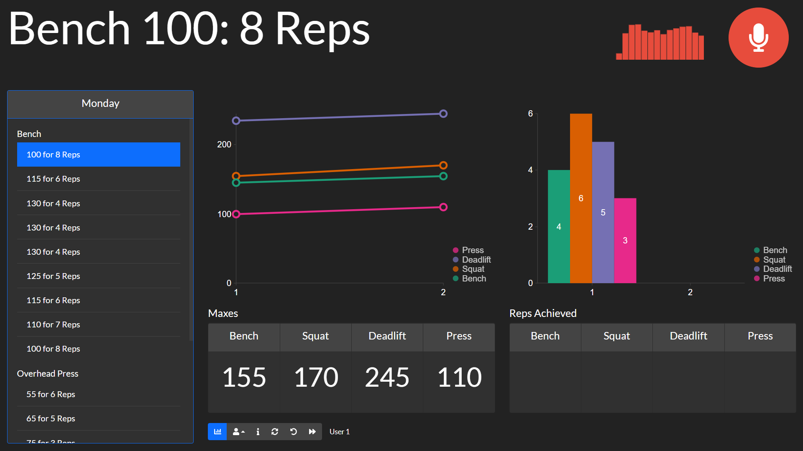
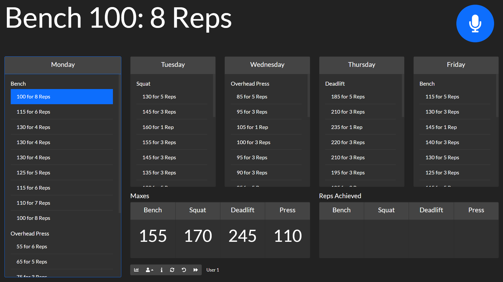

Workout Manager
===============

This is a voice-controlled dashboard I created to manage the weightlifting program I am running, [NSuns 5/3/1](https://thefitness.wiki/routines/nsuns-lp/)

This cannot be built without the corresponding Rhino context files and Porcupine wake word files, but the licenses prevent me from putting those on Github publicly. The licenses are only free for personal use.

[Picovoice](https://picovoice.ai/) is where these can be found/built.

Building
--------

The bundle is created with `yarn build`, which is using the default create-react-app webpack configuration to build static files.

Serving
-------

The static files are served through Flask in python, with a simple api to update the maxes/reps achieved each week. This way, the server can be started/stopped, and the page refreshed without losing data.

I chose to go the Flask web server route because using the filesystem module `fs` via node would require a lot more configuration. This module is not included in `create-react-app` by default.

Deployment
----------
The plan is to host this locally on a raspberry pi that is connected to a TV in my home gym. It will just be running the development server, since it doesn't even need to be connected to the internet.